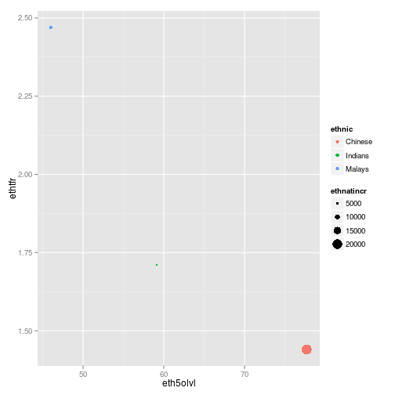
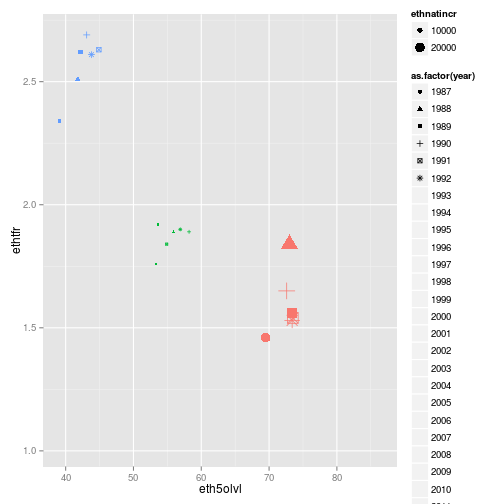

Singapore - Academic Achievement vs Fertility Rate
========================================================
author: A population study in Shiny application
date: 25 Jan 2015
font-family: 'Helvetica'

Introduction
========================================================

Like many other developed countries, Singapore is struggling with low birth rate - usually measured in terms of Total Fertility Rate (TFR).

Some usual factors associated with low TFR:
* High Affluence
* Educated Population (especially Women)


In this assignment, we evaluate relationship of Education Achievement and its low TFR, and the effective way delivering this information.


Dataset
========================================================

The dataset is taken from Singapore Government Database (http://www.data.gov.sg/):
* Resident Total Fertility Rate by Ethnic Group
* Percentage of Students With at Least 5 O-Level Passes by Ethnic Group
* Natural Increase by Ethnic Group

Shiny is used to present the timeseries data:
* Shiny allows interactivity
* Shiny is relatively simple (short turn-around)


Analysis
========================================================

The data shows that the trend overtime is higher passing rate and lower fertility rate.

The trend is even true when there were small reversal 2006/07 and 2010/11.

The trend is best seen as time series; however, usual timeseries plot is not able to represent all information at once clearly. The following code plots the series on next page.


```r
qplot(eth5olvl, ethtfr, data=subset(sgedutfr, year==1997), color=ethnic, size=ethnatincr)
qplot(eth5olvl, ethtfr, data=sgedutfr, color=ethnic, shape=as.factor(year), size=ethnatincr)
```


Effective Plot
========================================================

Single year plot: clear info, no trend.
 

***

Time series plot: too much info, unobservable trend.
 


Conclusion
========================================================

The full timeseries is plotted as web application using Shiny instead:
https://yrabin.shinyapps.io/dataprod/

Shiny interactivity allows the user to observe the info year by year clearly. The slider and "Play" button gives users instant information on the trend.

Based on the observed trend, the following are conclusions:
* Singapore secondary education achievement improves over time, while its TFR declines.
* There seems to be relationship between Singapore edcucation achievement and its TFR (for further analsys)
* Shiny's interactivity allows users to focus on a number of information on particular year & observe trend over time
